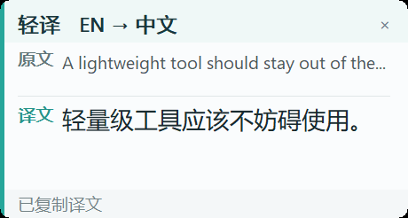
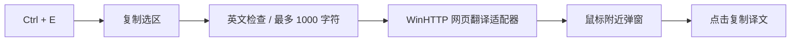

# 轻译 / Quick Translate

原生 Win32 划词翻译实验工具。选中英文后按 `Ctrl + E`，复制选区并联网翻译，在鼠标附近显示中文。代码独立于桌宠项目，不需要打包任何桌宠素材。

> **数据会离开本机。** 选中文字通过 HTTPS 发送至 Microsoft Bing 网页翻译服务。不要选择密码、密钥、客户资料或保密文档；这不是离线翻译工具。

## 效果预览



截图来自程序实际弹窗，使用固定公开测试句生成，不包含用户文档、账号或私人剪贴板内容。

## 实现结构



`src/main.cpp` 管理 Win32 界面和托盘，`selection` 处理选区，`translation` 封装服务调用，`util` 提供编码与解析辅助。程序不主动写入翻译历史，但选区和译文会进入系统剪贴板；第三方服务和系统剪贴板历史的行为不由本程序保证。

## 从源码构建

要求 Windows、PowerShell 与支持 C++17 的 MinGW-w64。把 `g++.exe` 加入 PATH，或通过 `-Compiler` 指定其位置；也可设置 `CXX` 环境变量。

```powershell
.\build.ps1
.\tests\run-core-tests.ps1
```

可选：`build.ps1 -OutputRoot .\.verification` 在独立输出目录构建，不覆盖日常使用的 EXE。`packaging/` 是启动脚本的受控源文件，构建不再依赖预先存在的 build 产物。

## 使用

1. 构建后双击 `run.bat` 或 `build/quick-translate.exe`。
2. 选中英文，按 `Ctrl + E`。单击译文复制，弹窗约 20 秒后隐藏。
3. 托盘菜单可退出；程序为单实例。管理员窗口可能拒绝普通权限进程模拟复制，不应为翻译而默认提升管理员权限。
4. `release/` 是构建生成的便携目录，不直接提交 Git。

只有显式运行生成目录内的“启用开机启动”脚本才会创建当前用户启动快捷方式；构建脚本不会启用自启动。重新构建默认目录前先从托盘退出旧程序。

## 翻译服务依赖与发布边界

- 当前适配器使用 Bing 网页接口和会话参数，不是承诺稳定的官方桌面 SDK；服务变化、限流或网络问题可能导致失败。
- 不在仓库保存服务令牌、Cookie 或用户文本。生产/商业发布前应评估服务条款，并改用具有正式授权与明确配额的 API；本仓库不承诺免费服务持续可用。
- `core_unit_test` 是无网络的字符串与选择判定测试；`translation_self_test` 会向服务发送固定英文例句；热键集成测试会操作剪贴板。后两者不是默认离线测试的一部分。
- 本轮构建/离线测试结果以整理报告为准。未把历史联调结果当作今天的服务可用性。
- 当前仓库公开展示，但尚未选定开源 LICENSE；公开可见不等于授予复制、修改或再分发许可。README 已加入使用固定公开测试句生成的真实程序截图；不使用设计图冒充运行效果。
